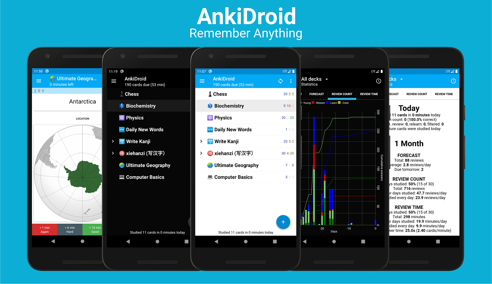

<a href="https://crowdin.com/project/ankidroid"></img></a>

<a href="https://discord.gg/qjzcRTx"></img></a>

# AnkiDroid
A semi-official port of the open source [Anki](https://apps.ankiweb.net/index.html) spaced repetition flashcard system to Android. Memorize anything with AnkiDroid!

</img>

### Features

 
- Night mode
- Whiteboard 
- Progress widget
- Detailed statistics
- Syncing with AnkiWeb
- Write answers (optional)
- Text-to-speech integration
- More than 6000 premade decks
- Spaced repetition (supermemo 2 algorithm)
- Supported contents: text, images, sounds, MathJax
- Add cards by intent from other applications like dictionaries

Install
---------

Wiki
----
View [Wiki](https://github.com/ankidroid/Anki-Android/wiki)

Help
----
Check the [user manual](https://ankidroid.org/docs/manual.html) and the wiki for usage instructions. See the [help page](https://ankidroid.org/docs/help.html) 
for how to submit a bug report or contact a project member, etc.

Contribute
----------
You can contribute to AnkiDroid by beta testing, translating, or submitting code. 
See the [contribution wiki page](https://github.com/ankidroid/Anki-Android/wiki/Contributing) for more info.

Join Us On
----------

## Credits
<!--- Do not rename this section. AnkiDroid contains a deep link to the section
header - see https://github.com/ankidroid/Anki-Android/pull/11803 --->

### Code Contributors

Thanks to these awesome code contributors who keep this project going

### [Sponsors](https://opencollective.com/ankidroid#sponsor)

### [Backers](https://opencollective.com/ankidroid#backer)

A big thank you to each of our 🙏

Your generous donations mean the world to us, and we can't express our gratitude enough. Your support fuels our mission and helps us make a real difference

### [Translators](https://crowdin.com/project/ankidroid/activity-stream)

Thanks to our 1400 translators, for allowing us to be available, partially or totally, in 99 languages as of July 2022.

License
-------
* [GPL-3.0 License](https://github.com/ankidroid/Anki-Android/blob/main/COPYING)
* [AGPL-3.0 Licence](https://github.com/ankitects/anki/blob/main/LICENSE) for some part of the back-end
