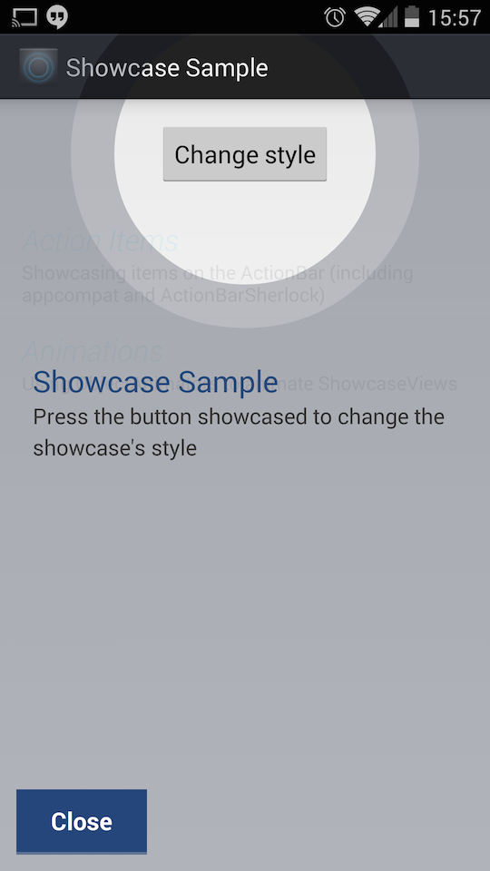
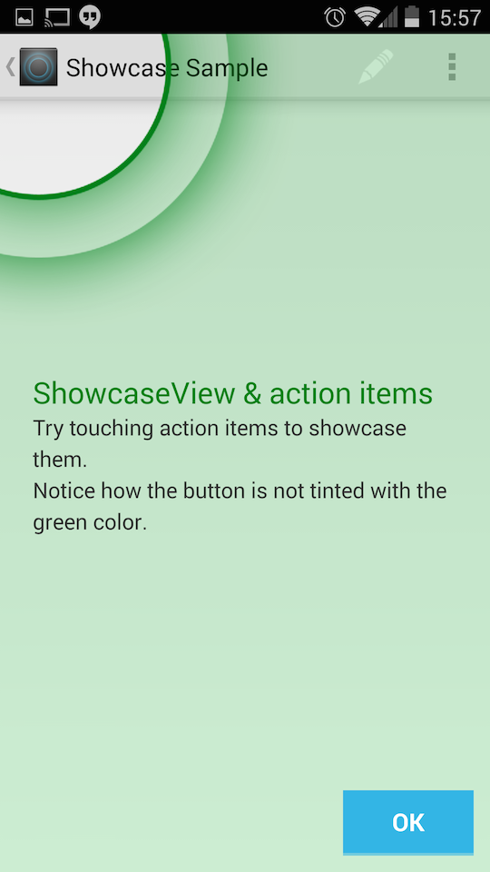

ShowcaseView
====

The ShowcaseView (SCV) library is designed to highlight and showcase specific parts of apps to the user with a distinctive and attractive overlay. This library is great for pointing out points of interest for users, gestures, or obscure but useful items.

The library is based on the "Cling" view found in the Launcher on Ice-Cream Sandwich and Jelly Bean.

Project set-up
====

**ShowcaseView currently supports API LEVEL 11+**

If you're using a Gradle-based project, then you can add SCV as a dependency directly:

~~~
compile 'com.github.amlcurran.showcaseview:library:5.0.0'
~~~

If you're using Maven (but not Gradle), you can add the APKlib as a dependency:

~~~
<dependency>
  <groupId>com.github.amlcurran.showcaseview</groupId>
  <artifactId>library</artifactId>
  <version>5.0.0</version>
  <type>apklib</type>
</dependency>
~~~

If you're using a standard project without either Maven or Gradle, you'll have to download the project, and the add the library manually to your project.

Usage
====

To use ShowcaseView, use the Builder pattern.

As an example:

~~~
new ShowcaseView.Builder(this)
    .setTarget(new ActionViewTarget(this, ActionViewTarget.Type.HOME))
    .setContentTitle("ShowcaseView")
    .setContentText("This is highlighting the Home button")
    .hideOnTouchOutside()
    .build();
~~~

You can use styles to customise how a ShowcaseView looks. I'll write more documentation soon, but for now, check out the sample project's [styles](https://github.com/amlcurran/ShowcaseView/blob/master/sample/src/main/res/values/styles.xml).

Sample Project
----
There's a sample project available which you can find in the project, or as an app on the [Google Play Store](https://play.google.com/store/apps/details?id=com.espian.showcaseview.sample).

What's the legacy branch?
----
The [legacy branch](https://github.com/amlcurran/ShowcaseView/tree/legacy) is still available for people to use. This has more features than the master branch, but it more unwieldy to use and less stable. I don't support it at all - you'll have to build and compile it yourself. It isn't available on Maven Central either.

Is it worth using?
----
Perhaps. Why not ask
[Google](https://github.com/googlecast/CastVideos-android),
[HaxSync](https://play.google.com/store/apps/details?id=org.mots.haxsync), or [AllCast](https://play.google.com/store/apps/details?id=com.koushikdutta.cast), which each use the library?

What's missing in v5
---

- ShowcaseViews: the class which queues up ShowcaseViews in a tutorial-type method. I never
really liked this class (generally, you should use SCV sparingly); I'll add it back in based on
the Builder class when I can.
- Ghostly hand: this has gone for now until I can test-drive it back in.
- Scale multiplier: this has gone for simplicity - if people really loved it I'll add in back in

FAQs
---

**Where has X feature gone?**

Look one paragraph up!

**Waaaah, but I really liked feature X!!!**

Switch to the legacy branch and use that one then! All legacy features are in there.

**What happened to all the other constructors?**

Gone. You should be using the new Target API.

**What if I want to add feature X?**

At the moment, I'm not taking any feature requests. It's unlikely I'll take many anyway,
unless I feel they are both useful and well tested. If you have some cosmetic tweak then I don't
want that added into the library as *another* option. But, if you need to make a tweak to the
library to add such a tweak to your own, overridden ShowcaseView then that is totally great.

Copyright and Licensing
----

Copyright Alex Curran ([@amlcurran](https://twitter.com/amlcurran)) © 2012-2014. All rights reserved.

This library is distributed under an Apache 2.0 License.
